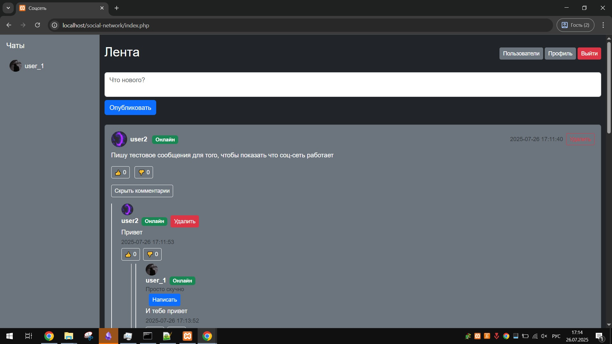

# Social Network App

Простое веб-приложение социальной сети, разработанное на PHP с использованием MySQL и Bootstrap. Позволяет пользователям публиковать посты, комментировать, ставить лайки/дизлайки, подписываться на других пользователей и обмениваться личными сообщениями. Реализована авторизация, управление профилем и удаление собственных постов/комментариев с AJAX.



## Основные функции
- **Авторизация и регистрация**: Вход и регистрация пользователей с проверкой данных.
- **Посты**: Создание, просмотр и удаление постов. Отображение постов в ленте от подписок и текущего пользователя.
- **Комментарии**: Добавление, просмотр и удаление комментариев (включая вложенные ответы).
- **Лайки/Дизлайки**: Возможность лайкать или дизлайкать посты и комментарии.
- **Подписки**: Подписка и отписка от пользователей с отображением количества подписчиков/подписок.
- **Профиль пользователя**: Просмотр профиля, изменение имени, статуса и аватара.
- **Личные сообщения**: Отправка и получение сообщений между пользователями.
- **Удаление контента**: Асинхронное удаление собственных постов и комментариев с анимацией через AJAX.

## Технологии
- **Backend**: PHP 8.x, MySQL (PDO)
- **Frontend**: Bootstrap 5.3, jQuery 3.7.1
- **База данных**: MySQL
- **Дополнительно**: AJAX для асинхронных операций, HTML5, CSS3

## Требования
- PHP 8.0+
- MySQL 5.7+
- Веб-сервер (Apache/Nginx)
- Composer (для управления зависимостями, если используются библиотеки)

## Установка
1. **Клонируйте репозиторий**:
   ```bash
   git clone https://github.com/tailogs/social-network.git
   cd social-network
   ```

2. **Настройте базу данных**:
   - Создайте базу данных MySQL.
   - Импортируйте структуру таблиц из файла `database.sql`:
     ```bash
     mysql -u username -p database_name < database.sql
     ```
   - Настройте подключение к базе данных в `inc/db.php`:
     ```php
     $dsn = 'mysql:host=localhost;dbname=your_database_name';
     $username = 'your_username';
     $password = 'your_password';
     ```

3. **Настройте директорию для загрузки файлов**:
   - Создайте папку `Uploads/` в корне проекта.
   - Убедитесь, что она имеет права на запись (например, `chmod 777 Uploads/`).

4. **Настройте веб-сервер**:
   - Убедитесь, что корневая папка проекта доступна через веб-сервер.
   - Настройте виртуальный хост или используйте встроенный сервер PHP:
     ```bash
     php -S localhost:8000
     ```

5. **Запустите приложение**:
   - Откройте приложение в браузере: `http://localhost:8000`.
   - Зарегистрируйтесь или войдите под тестовым аккаунтом.

## Структура проекта
- `index.php`: Главная страница с лентой постов.
- `profile.php`: Страница профиля пользователя.
- `view_post.php`: Страница просмотра отдельного поста.
- `comments.php`: Скрипт для загрузки комментариев через AJAX.
- `delete.php`: Обработка удаления постов и комментариев.
- `inc/db.php`: Подключение к базе данных.
- `inc/auth.php`: Функции авторизации.
- `inc/header.php`, `inc/footer.php`: Шаблоны для шапки и футера.
- `Uploads/`: Директория для хранения аватаров.
- `assets/css/style.css`: Пользовательские стили.

## Использование
1. **Регистрация/Вход**:
   - Зарегистрируйтесь через `register.php` или войдите через `login.php`.
2. **Публикация постов**:
   - На главной странице (`index.php`) создавайте посты через форму.
3. **Комментирование**:
   - Добавляйте комментарии к постам или отвечайте на существующие комментарии.
4. **Удаление контента**:
   - Кнопки "Удалить" отображаются только для собственных постов и комментариев.
   - Удаление происходит асинхронно с анимацией (посты исчезают с главной/профиля, комментарии — из списка).
5. **Лайки/Дизлайки**:
   - Нажмите 👍 или 👎 для оценки постов и комментариев.
6. **Подписки**:
   - Подписывайтесь на пользователей через их профили.
7. **Сообщения**:
   - Отправляйте личные сообщения через кнопку "Написать" в профиле пользователя.

## Тестирование
1. Войдите под аккаунтом (например, `user_1`, ID=2).
2. Проверьте кнопки "Удалить" для постов (ID=1, 2, 3, 5) и комментариев (ID=1, 2, 3, 4).
3. Удалите пост (например, ID=1) и убедитесь, что он исчезает, а связанные комментарии и лайки удалены из базы.
4. Удалите комментарий (например, ID=1) и проверьте, что он и его ответы (ID=3, 4) исчезли.
5. Под другим аккаунтом (например, `user2`, ID=3) убедитесь, что кнопки удаления для чужого контента отсутствуют.

## Отладка
- **Ошибки AJAX**:
  - Откройте консоль браузера (F12 → Network) и проверьте запросы к `delete.php`.
  - Ответ должен быть в формате `{ "success": true, "type": "post" }` или `{ "success": true, "type": "comment", "post_id": X }`.
- **Логирование**:
  - Добавьте в `delete.php`:
    ```php
    file_put_contents('delete_log.txt', date('Y-m-d H:i:s') . " - post_id: $post_id, comment_id: $comment_id, user_id: $user_id\n", FILE_APPEND);
    ```
  - Проверьте лог в `delete_log.txt`.
- **Проверка базы данных**:
  - После удаления поста:
    ```sql
    SELECT * FROM posts WHERE id = 1;
    ```
  - После удаления комментария:
    ```sql
    SELECT * FROM comments WHERE id IN (1, 3, 4);
    SELECT * FROM likes WHERE comment_id IN (1, 3, 4);
    ```

## Лицензия
MIT License. См. [LICENSE](LICENSE) для подробностей.

## Контакты
Если у вас есть вопросы или предложения, создайте issue в репозитории.
